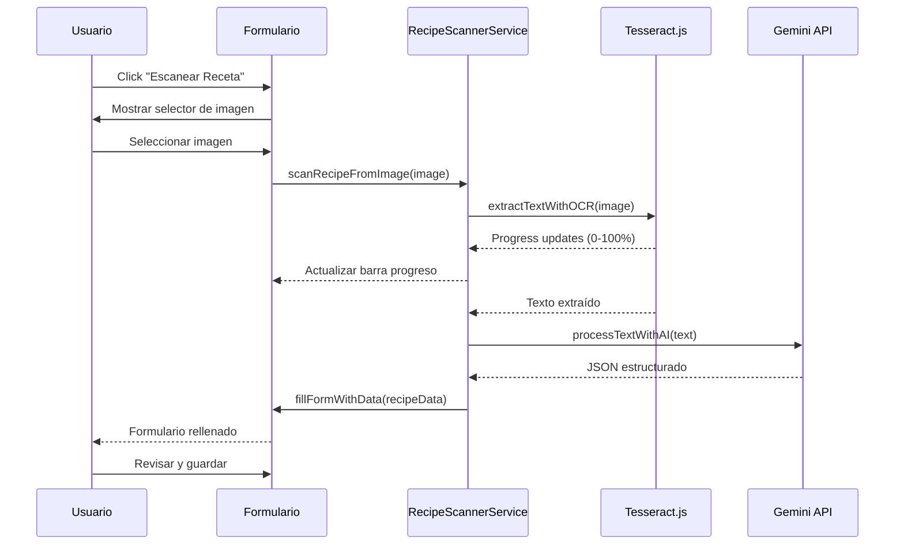

# Design Document - Escanear Receta con IA

## Overview

Esta funcionalidad integra OCR (Tesseract.js) y procesamiento de IA (Gemini API) para permitir a los usuarios escanear imágenes de recetas y crear recetas automáticamente. El flujo completo es:

1. Usuario selecciona imagen de receta
2. Tesseract.js extrae texto de la imagen (OCR local en navegador)
3. Gemini API procesa y estructura el texto en formato JSON
4. Sistema rellena automáticamente el formulario de receta
5. Usuario revisa y guarda la receta

## Architecture

### Componentes Principales

```
┌─────────────────────────────────────────────────────────────┐
│                    Usuario                                   │
└────────────────────┬────────────────────────────────────────┘
                     │
                     ▼
┌─────────────────────────────────────────────────────────────┐
│              UI - Formulario de Receta                       │
│  ┌──────────────────────────────────────────────────────┐  │
│  │  📸 Botón "Escanear Receta"                          │  │
│  │  📊 Barra de Progreso                                │  │
│  │  ✅ Feedback de Estado                               │  │
│  └──────────────────────────────────────────────────────┘  │
└────────────────────┬────────────────────────────────────────┘
                     │
                     ▼
┌─────────────────────────────────────────────────────────────┐
│           RecipeScannerService (Nueva Clase)                 │
│  ┌──────────────────────────────────────────────────────┐  │
│  │  • scanRecipeFromImage(imageFile)                    │  │
│  │  • extractTextWithOCR(imageFile)                     │  │
│  │  • processTextWithAI(text)                           │  │
│  │  • fillFormWithData(recipeData)                      │  │
│  └──────────────────────────────────────────────────────┘  │
└──────────┬─────────────────────────────────┬────────────────┘
           │                                 │
           ▼                                 ▼
┌──────────────────────┐         ┌──────────────────────────┐
│   Tesseract.js       │         │    GeminiAPIService      │
│   (OCR Local)        │         │    (Nueva Clase)         │
│                      │         │                          │
│  • recognize()       │         │  • configure()           │
│  • setLanguage()     │         │  • parseRecipe()         │
│  • progress events   │         │  • validateResponse()    │
└──────────────────────┘         └──────────────────────────┘
```

### Flujo de Datos



## Components and Interfaces

### 1. GeminiAPIService Class

Gestiona toda la comunicación con Gemini API.

```javascript
class GeminiAPIService {
    constructor() {
        this.apiKey = null;
        this.baseURL = 'https://generativelanguage.googleapis.com/v1beta/models/gemini-1.5-flash:generateContent';
        this.loadAPIKey();
    }
    
    /**
     * Load API Key from localStorage
     */
    loadAPIKey() {
        this.apiKey = localStorage.getItem('gemini_api_key');
    }
    
    /**
     * Save API Key to localStorage
     * @param {string} apiKey - Gemini API Key
     */
    saveAPIKey(apiKey) {
        this.apiKey = apiKey;
        localStorage.setItem('gemini_api_key', apiKey);
    }
    
    /**
     * Remove API Key from localStorage
     */
    removeAPIKey() {
        this.apiKey = null;
        localStorage.removeItem('gemini_api_key');
    }
    
    /**
     * Check if API Key is configured
     * @returns {boolean}
     */
    hasAPIKey() {
        return this.apiKey !== null && this.apiKey.trim() !== '';
    }
    
    /**
     * Test API Key validity
     * @returns {Promise<boolean>}
     */
    async testAPIKey() {
        if (!this.hasAPIKey()) return false;
        
        try {
            const response = await this.generateContent('Test');
            return response !== null;
        } catch (error) {
            return false;
        }
    }
    
    /**
     * Parse recipe text and structure it
     * @param {string} text - Raw text from OCR
     * @returns {Promise<Object>} Structured recipe data
     */
    async parseRecipeText(text) {
        const prompt = `
Analiza el siguiente texto de una receta y extrae la información en formato JSON.

TEXTO DE LA RECETA:
${text}

Devuelve ÚNICAMENTE un objeto JSON válido con esta estructura exacta:
{
  "name": "Nombre de la receta",
  "category": "una de: carne, verdura, pescado, fruta, cereales, mix, con-huevo, pollo, escabeche, marisco, postres, cerdo, conejo, encurtidos, legumbres, salsas",
  "totalTime": "formato: Xh Ymin (ejemplo: 1h 30min)",
  "caravanFriendly": true o false,
  "kitchenAppliances": ["sarten", "olla", "horno", etc],
  "ingredients": [
    {
      "name": "nombre del ingrediente",
      "quantity": número o null,
      "unit": "g, kg, ml, l, taza, cucharada, cucharadita, pizca, unidad, al gusto"
    }
  ],
  "sequences": [
    {
      "ingredientNames": ["ingrediente1", "ingrediente2"],
      "description": "descripción del paso",
      "duration": "formato: Xh Ymin o vacío"
    }
  ]
}

REGLAS IMPORTANTES:
- Si no encuentras algún campo, usa null o array vacío
- Los nombres de ingredientes deben coincidir exactamente en sequences
- La categoría debe ser una de las opciones listadas
- Los aparatos de cocina deben ser: sarten, olla, olla-presion, horno, microondas, freidora-aire, sandwichera, batidora, wok, vaporera, thermomix
- Devuelve SOLO el JSON, sin texto adicional
`;

        const response = await this.generateContent(prompt);
        
        if (!response) {
            throw new Error('No se recibió respuesta de Gemini API');
        }
        
        // Parse JSON from response
        const jsonMatch = response.match(/\{[\s\S]*\}/);
        if (!jsonMatch) {
            throw new Error('No se pudo extraer JSON de la respuesta');
        }
        
        const recipeData = JSON.parse(jsonMatch[0]);
        return this.validateRecipeData(recipeData);
    }
    
    /**
     * Generate content using Gemini API
     * @param {string} prompt - Prompt text
     * @returns {Promise<string>} Generated text
     */
    async generateContent(prompt) {
        if (!this.hasAPIKey()) {
            throw new Error('API Key no configurada');
        }
        
        const url = `${this.baseURL}?key=${this.apiKey}`;
        
        const response = await fetch(url, {
            method: 'POST',
            headers: {
                'Content-Type': 'application/json'
            },
            body: JSON.stringify({
                contents: [{
                    parts: [{
                        text: prompt
                    }]
                }]
            })
        });
        
        if (!response.ok) {
            const error = await response.json();
            throw new Error(`Gemini API Error: ${error.error?.message || 'Unknown error'}`);
        }
        
        const data = await response.json();
        return data.candidates[0]?.content?.parts[0]?.text || null;
    }
    
    /**
     * Validate and sanitize recipe data
     * @param {Object} data - Raw recipe data from Gemini
     * @returns {Object} Validated recipe data
     */
    validateRecipeData(data) {
        const validCategories = ['carne', 'verdura', 'pescado', 'fruta', 'cereales', 'mix', 
                                'con-huevo', 'pollo', 'escabeche', 'marisco', 'postres', 
                                'cerdo', 'conejo', 'encurtidos', 'legumbres', 'salsas'];
        
        const validAppliances = ['sarten', 'olla', 'olla-presion', 'horno', 'microondas', 
                                'freidora-aire', 'sandwichera', 'batidora', 'wok', 
                                'vaporera', 'thermomix'];
        
        const validUnits = ['g', 'kg', 'ml', 'l', 'taza', 'cucharada', 'cucharadita', 
                           'pizca', 'unidad', 'al gusto'];
        
        // Validate and sanitize
        const validated = {
            name: data.name || 'Receta Escaneada',
            category: validCategories.includes(data.category) ? data.category : '',
            totalTime: data.totalTime || '',
            caravanFriendly: data.caravanFriendly === true,
            kitchenAppliances: (data.kitchenAppliances || []).filter(a => validAppliances.includes(a)),
            ingredients: (data.ingredients || []).map(ing => ({
                name: ing.name || '',
                quantity: ing.quantity || null,
                unit: validUnits.includes(ing.unit) ? ing.unit : ''
            })).filter(ing => ing.name),
            sequences: (data.sequences || []).map(seq => ({
                ingredientNames: seq.ingredientNames || [],
                description: seq.description || '',
                duration: seq.duration || ''
            })).filter(seq => seq.description)
        };
        
        // Ensure at least one ingredient
        if (validated.ingredients.length === 0) {
            throw new Error('No se detectaron ingredientes en la receta');
        }
        
        return validated;
    }
}
```

### 2. RecipeScannerService Class

Orquesta el proceso completo de escaneo.

```javascript
class RecipeScannerService {
    constructor(geminiService) {
        this.geminiService = geminiService;
        this.tesseractWorker = null;
        this.isProcessing = false;
    }
    
    /**
     * Initialize Tesseract worker
     */
    async initTesseract() {
        if (this.tesseractWorker) return;
        
        this.tesseractWorker = await Tesseract.createWorker('spa', 1, {
            logger: m => console.log(m)
        });
    }
    
    /**
     * Scan recipe from image file
     * @param {File} imageFile - Image file to scan
     * @param {Function} onProgress - Progress callback
     * @returns {Promise<Object>} Structured recipe data
     */
    async scanRecipeFromImage(imageFile, onProgress = null) {
        if (this.isProcessing) {
            throw new Error('Ya hay un escaneo en proceso');
        }
        
        this.isProcessing = true;
        
        try {
            // Step 1: Validate image
            this.updateProgress(onProgress, 'Validando imagen...', 0);
            await this.validateImage(imageFile);
            
            // Step 2: Optimize image
            this.updateProgress(onProgress, 'Optimizando imagen...', 10);
            const optimizedImage = await this.optimizeImage(imageFile);
            
            // Step 3: Extract text with OCR
            this.updateProgress(onProgress, 'Extrayendo texto (OCR)...', 20);
            const text = await this.extractTextWithOCR(optimizedImage, (progress) => {
                this.updateProgress(onProgress, 'Extrayendo texto (OCR)...', 20 + (progress * 0.4));
            });
            
            if (!text || text.trim().length < 10) {
                throw new Error('No se detectó suficiente texto en la imagen');
            }
            
            // Step 4: Process with AI
            this.updateProgress(onProgress, 'Procesando con IA...', 60);
            const recipeData = await this.geminiService.parseRecipeText(text);
            
            // Step 5: Complete
            this.updateProgress(onProgress, 'Completado', 100);
            
            return recipeData;
            
        } finally {
            this.isProcessing = false;
        }
    }
    
    /**
     * Extract text from image using OCR
     * @param {File|Blob} image - Image to process
     * @param {Function} onProgress - Progress callback
     * @returns {Promise<string>} Extracted text
     */
    async extractTextWithOCR(image, onProgress = null) {
        await this.initTesseract();
        
        const result = await this.tesseractWorker.recognize(image, {
            logger: (m) => {
                if (m.status === 'recognizing text' && onProgress) {
                    onProgress(m.progress);
                }
            }
        });
        
        return result.data.text;
    }
    
    /**
     * Validate image file
     * @param {File} imageFile - Image file to validate
     */
    async validateImage(imageFile) {
        // Check file type
        const validTypes = ['image/jpeg', 'image/png', 'image/webp', 'image/heic'];
        if (!validTypes.includes(imageFile.type)) {
            throw new Error('Formato de imagen no soportado. Usa JPG, PNG, WEBP o HEIC');
        }
        
        // Check file size (max 10MB)
        if (imageFile.size > 10 * 1024 * 1024) {
            throw new Error('La imagen es demasiado grande. Máximo 10MB');
        }
        
        // Check image dimensions
        const dimensions = await this.getImageDimensions(imageFile);
        if (dimensions.width < 300 || dimensions.height < 300) {
            throw new Error('La imagen es demasiado pequeña. Mínimo 300x300 píxeles');
        }
        if (dimensions.width > 4000 || dimensions.height > 4000) {
            throw new Error('La imagen es demasiado grande. Máximo 4000x4000 píxeles');
        }
    }
    
    /**
     * Optimize image for OCR
     * @param {File} imageFile - Original image
     * @returns {Promise<Blob>} Optimized image
     */
    async optimizeImage(imageFile) {
        // If image is already small enough, return as is
        if (imageFile.size < 2 * 1024 * 1024) {
            return imageFile;
        }
        
        // Resize image to max 2000px width/height
        return await this.resizeImage(imageFile, 2000);
    }
    
    /**
     * Resize image
     * @param {File} imageFile - Image to resize
     * @param {number} maxSize - Maximum width/height
     * @returns {Promise<Blob>} Resized image
     */
    async resizeImage(imageFile, maxSize) {
        return new Promise((resolve, reject) => {
            const img = new Image();
            const canvas = document.createElement('canvas');
            const ctx = canvas.getContext('2d');
            
            img.onload = () => {
                let width = img.width;
                let height = img.height;
                
                if (width > height) {
                    if (width > maxSize) {
                        height = (height * maxSize) / width;
                        width = maxSize;
                    }
                } else {
                    if (height > maxSize) {
                        width = (width * maxSize) / height;
                        height = maxSize;
                    }
                }
                
                canvas.width = width;
                canvas.height = height;
                ctx.drawImage(img, 0, 0, width, height);
                
                canvas.toBlob(resolve, 'image/jpeg', 0.9);
            };
            
            img.onerror = reject;
            img.src = URL.createObjectURL(imageFile);
        });
    }
    
    /**
     * Get image dimensions
     * @param {File} imageFile - Image file
     * @returns {Promise<Object>} {width, height}
     */
    async getImageDimensions(imageFile) {
        return new Promise((resolve, reject) => {
            const img = new Image();
            img.onload = () => {
                resolve({ width: img.width, height: img.height });
            };
            img.onerror = reject;
            img.src = URL.createObjectURL(imageFile);
        });
    }
    
    /**
     * Update progress callback
     * @param {Function} callback - Progress callback
     * @param {string} message - Progress message
     * @param {number} percent - Progress percentage (0-100)
     */
    updateProgress(callback, message, percent) {
        if (callback) {
            callback({ message, percent });
        }
    }
    
    /**
     * Cleanup resources
     */
    async cleanup() {
        if (this.tesseractWorker) {
            await this.tesseractWorker.terminate();
            this.tesseractWorker = null;
        }
    }
}
```

## Data Models

### Recipe Scan Result

```javascript
{
    name: string,              // Nombre de la receta
    category: string,          // Categoría (opcional)
    totalTime: string,         // Tiempo total (formato: "1h 30min")
    caravanFriendly: boolean,  // Apto para caravana
    kitchenAppliances: string[], // IDs de aparatos
    ingredients: [
        {
            name: string,      // Nombre del ingrediente
            quantity: number,  // Cantidad (opcional)
            unit: string       // Unidad (opcional)
        }
    ],
    sequences: [
        {
            ingredientNames: string[],  // Nombres de ingredientes
            description: string,         // Descripción del paso
            duration: string            // Duración (opcional)
        }
    ]
}
```

## UI Components

### 1. Scan Recipe Button

Botón principal en el formulario de recetas.

```html
<button id="scan-recipe-btn" class="btn-scan-recipe">
    📸 Escanear Receta
</button>
```

### 2. Scan Modal

Modal para el proceso de escaneo.

```html
<div id="scan-modal" class="scan-modal hidden">
    <div class="scan-modal-content">
        <div class="scan-modal-header">
            <h3>📸 Escanear Receta</h3>
            <button class="btn-close">✕</button>
        </div>
        
        <div class="scan-modal-body">
            <!-- Image upload area -->
            <div class="scan-upload-area">
                <input type="file" id="scan-image-input" accept="image/*">
                <div class="scan-upload-placeholder">
                    <span class="scan-upload-icon">📷</span>
                    <p>Selecciona una imagen de receta</p>
                </div>
            </div>
            
            <!-- Preview -->
            <div class="scan-preview hidden">
                
            </div>
            
            <!-- Progress -->
            <div class="scan-progress hidden">
                <div class="scan-progress-bar">
                    <div class="scan-progress-fill"></div>
                </div>
                <p class="scan-progress-text"></p>
            </div>
            
            <!-- Result -->
            <div class="scan-result hidden">
                <div class="scan-result-success">
                    <span class="scan-result-icon">✅</span>
                    <p>¡Receta escaneada exitosamente!</p>
                    <div class="scan-result-stats">
                        <span id="scan-ingredients-count">0 ingredientes</span>
                        <span id="scan-sequences-count">0 pasos</span>
                    </div>
                </div>
            </div>
        </div>
        
        <div class="scan-modal-footer">
            <button class="btn-secondary" id="scan-cancel-btn">Cancelar</button>
            <button class="btn-primary" id="scan-process-btn" disabled>Escanear</button>
        </div>
    </div>
</div>
```

### 3. API Key Configuration

Modal para configurar la API Key.

```html
<div id="api-key-modal" class="modal hidden">
    <div class="modal-content">
        <h3>🔑 Configurar API Key de Gemini</h3>
        <p>Para usar la funcionalidad de escaneo, necesitas una API Key de Google Gemini (gratis).</p>
        
        <div class="form-group">
            <label>API Key:</label>
            <input type="password" id="api-key-input" placeholder="Ingresa tu API Key">
            <button type="button" id="toggle-api-key-visibility">👁️</button>
        </div>
        
        <div class="api-key-actions">
            <button class="btn-secondary" id="test-api-key-btn">Probar</button>
            <button class="btn-primary" id="save-api-key-btn">Guardar</button>
        </div>
        
        <div class="api-key-help">
            <a href="https://aistudio.google.com/app/apikey" target="_blank">
                ¿Cómo obtener una API Key?
            </a>
        </div>
    </div>
</div>
```

## Error Handling

### Error Types

1. **Image Validation Errors**
   - Invalid format
   - File too large
   - Image too small/large
   
2. **OCR Errors**
   - No text detected
   - Low confidence
   - Processing timeout
   
3. **API Errors**
   - No API Key configured
   - Invalid API Key
   - Rate limit exceeded
   - Network error
   
4. **Parsing Errors**
   - Invalid JSON response
   - Missing required fields
   - No ingredients detected

### Error Messages

```javascript
const ERROR_MESSAGES = {
    NO_API_KEY: 'Configura tu API Key de Gemini para usar esta funcionalidad',
    INVALID_API_KEY: 'La API Key no es válida. Verifica e intenta nuevamente',
    INVALID_IMAGE_FORMAT: 'Formato de imagen no soportado. Usa JPG, PNG, WEBP o HEIC',
    IMAGE_TOO_LARGE: 'La imagen es demasiado grande. Máximo 10MB',
    IMAGE_TOO_SMALL: 'La imagen es demasiado pequeña. Mínimo 300x300 píxeles',
    NO_TEXT_DETECTED: 'No se detectó texto en la imagen. Intenta con una imagen más clara',
    OCR_FAILED: 'Error al extraer texto de la imagen',
    AI_PROCESSING_FAILED: 'Error al procesar el texto con IA',
    NO_INGREDIENTS: 'No se detectaron ingredientes en la receta',
    NETWORK_ERROR: 'Error de conexión. Verifica tu internet',
    RATE_LIMIT: 'Has excedido el límite de peticiones. Intenta más tarde',
    UNKNOWN_ERROR: 'Ocurrió un error inesperado'
};
```

## Testing Strategy

### Unit Tests

1. **GeminiAPIService**
   - Test API Key storage/retrieval
   - Test API Key validation
   - Test recipe parsing
   - Test data validation
   
2. **RecipeScannerService**
   - Test image validation
   - Test image optimization
   - Test OCR extraction
   - Test progress callbacks

### Integration Tests

1. **Complete Scan Flow**
   - Upload image → Extract text → Process with AI → Fill form
   - Test with different image types
   - Test with different recipe formats
   
2. **Error Scenarios**
   - Invalid images
   - No API Key
   - Network failures
   - Invalid responses

### Manual Testing

1. Test with real recipe images from books
2. Test with printed recipes
3. Test with handwritten recipes (expected to fail)
4. Test with different languages
5. Test with poor quality images

## Performance Considerations

1. **Image Optimization**
   - Resize large images before OCR
   - Compress images to reduce processing time
   - Cache Tesseract models
   
2. **Async Processing**
   - Use Web Workers for OCR (Tesseract.js does this automatically)
   - Show progress indicators
   - Allow cancellation
   
3. **Resource Management**
   - Terminate Tesseract worker when not in use
   - Clear image previews from memory
   - Limit concurrent scans to 1

## Security Considerations

1. **API Key Storage**
   - Store only in localStorage (client-side)
   - Never send to backend
   - Allow user to delete anytime
   
2. **Image Privacy**
   - Images processed locally (OCR)
   - Text sent to Gemini API only
   - No server-side storage
   
3. **Input Validation**
   - Validate image format and size
   - Sanitize extracted text
   - Validate AI responses

## Future Enhancements

1. **Batch Scanning**
   - Scan multiple recipes at once
   - Queue system for processing
   
2. **Improved OCR**
   - Support for handwritten text
   - Multi-language detection
   - Image preprocessing (contrast, rotation)
   
3. **Smart Suggestions**
   - Suggest missing information
   - Auto-categorize recipes
   - Detect cooking techniques
   
4. **Offline Mode**
   - Cache Gemini responses
   - Fallback to local parsing
   - Queue scans for later processing
