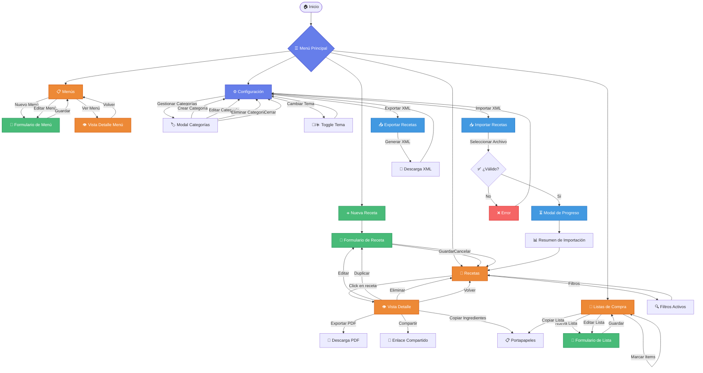
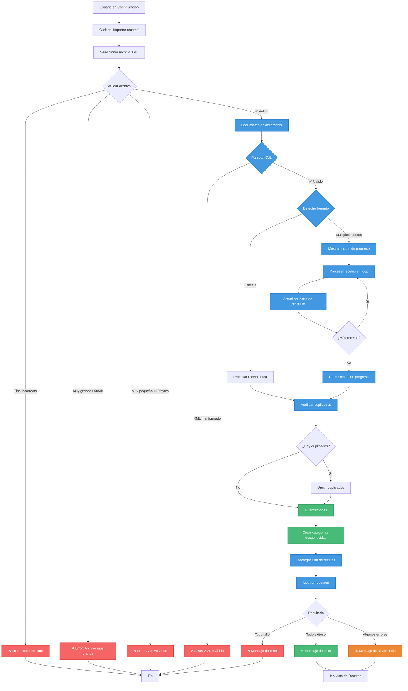
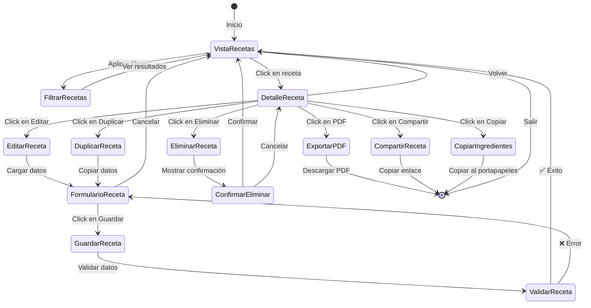
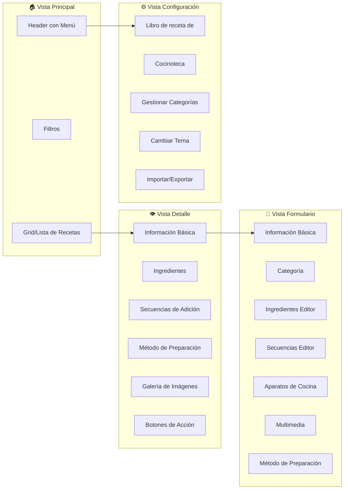
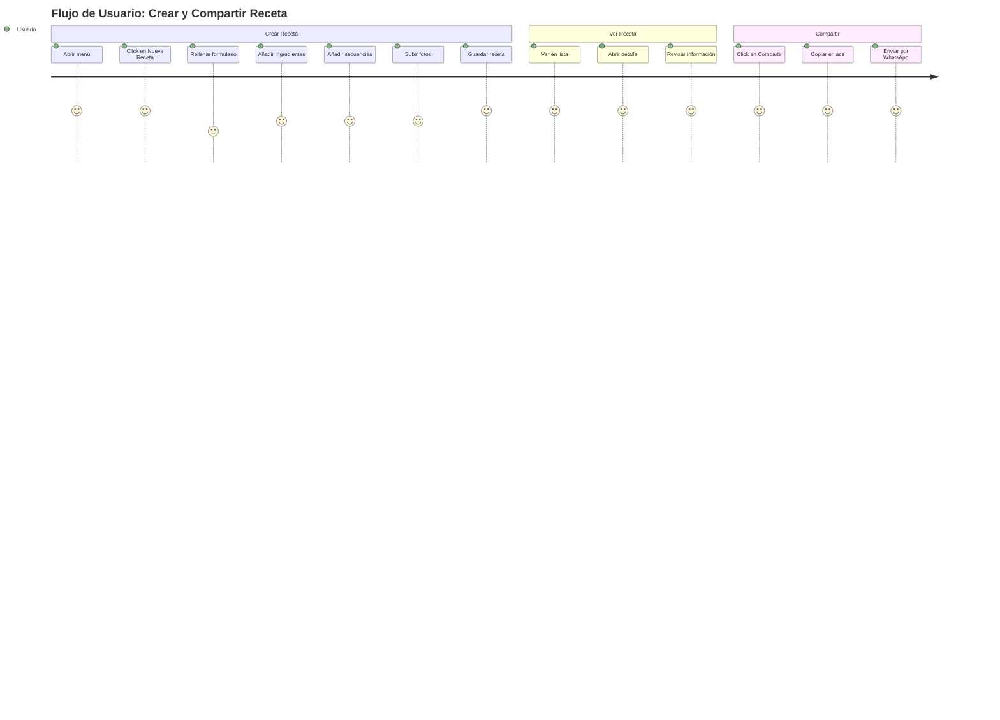

# Mapa de Navegación - mehaquedadobien 🍳

## Diagrama Principal de Navegación

---

## Flujo Detallado: Importación XML

---

## Flujo Detallado: Gestión de Recetas

---

## Estructura de Vistas

---

## Interacciones del Usuario

---

## Leyenda de Iconos

| Icono | Significado |
|-------|-------------|
| 🏠 | Inicio / Home |
| ☰ | Menú Principal |
| ➕ | Crear Nuevo |
| 📖 | Ver Recetas |
| 📋 | Menús Semanales |
| 🛒 | Listas de Compra |
| ⚙️ | Configuración |
| 👁️ | Vista Detalle |
| 📝 | Formulario / Editar |
| 🔍 | Filtros / Búsqueda |
| 📥 | Importar |
| 📤 | Exportar |
| 📄 | PDF |
| 🔗 | Compartir / Enlace |
| 📋 | Copiar al Portapapeles |
| ✅ | Éxito / Válido |
| ❌ | Error / Inválido |
| ⚠️ | Advertencia |
| ⏳ | Procesando / Cargando |
| 🏷️ | Categorías |
| 🌙 | Tema Oscuro |
| ☀️ | Tema Claro |

---

## Notas Técnicas

### Navegación Principal
- El menú hamburguesa (☰) está siempre visible en todas las resoluciones
- Todas las vistas principales son accesibles desde el menú
- La navegación usa `goToHome()`, `showRecipeForm()`, `showRecipeDetail()`, etc.

### Gestión de Estado
- La aplicación mantiene el estado de filtros activos
- Las vistas se ocultan/muestran con clases `.hidden`
- El tema se persiste en `localStorage`

### Modales
- Configuración
- Categorías
- Selector de Categorías (para menús)
- Progreso de Importación (nuevo)
- Opciones de Receta
- Opciones de Menú

### Persistencia
- Todas las recetas se guardan en IndexedDB
- Fallback a localStorage si IndexedDB no está disponible
- Las preferencias (tema, vista) se guardan en localStorage

---

## Cómo Usar Este Mapa

1. **En GitHub/GitLab**: Los diagramas Mermaid se renderizan automáticamente
2. **En VS Code**: Instala la extensión "Markdown Preview Mermaid Support"
3. **Online**: Copia el código y pégalo en [Mermaid Live Editor](https://mermaid.live/)
4. **Exportar**: Desde Mermaid Live puedes exportar a PNG, SVG o PDF

---

**Última actualización:** 7 de noviembre de 2025
