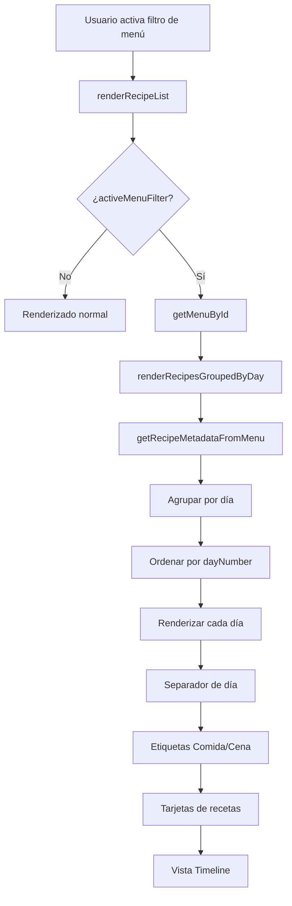

# Resumen: Timeline Semanal para Filtros de Menú

## 📋 Descripción

Implementación de vista de timeline semanal que agrupa y ordena las recetas por día de la semana cuando se activa un filtro de menú, mostrando comida y cena lado a lado con separadores visuales por día.

## 🎯 Problema

Cuando se activaba un filtro de menú (menú marcado como filtro con 🔖), las recetas aparecían desordenadas sin indicación de a qué día o comida pertenecían:

```
[Pollo] [Sopa] [Merluza] [Ensalada] [Lentejas] [Tortilla]
```

## ✅ Solución

Ahora las recetas se agrupan por día de la semana en orden cronológico, mostrando comida y cena lado a lado:

```
━━━━━━━━━━━━━━━━━━━━━━━━━━━━━━━━━━━━━━━━━━━━━━━━━━━━━━
📅 LUNES
━━━━━━━━━━━━━━━━━━━━━━━━━━━━━━━━━━━━━━━━━━━━━━━━━━━━━━

🍽️ Comida                    🌙 Cena
[🐔 Pollo al horno]          [🍲 Sopa de fideos]

━━━━━━━━━━━━━━━━━━━━━━━━━━━━━━━━━━━━━━━━━━━━━━━━━━━━━━
📅 MARTES
━━━━━━━━━━━━━━━━━━━━━━━━━━━━━━━━━━━━━━━━━━━━━━━━━━━━━━

🍽️ Comida                    🌙 Cena
[🐟 Merluza a la plancha]    [🥬 Ensalada mixta]
```

## 🔧 Implementación

### 1. Nueva Función: `getRecipeMetadataFromMenu(menu)`

Extrae metadata completa de cada receta en el menú (día, número de día, tipo de comida):

```javascript
getRecipeMetadataFromMenu(menu) {
    const metadata = new Map();
    
    // Day name mapping for ordering
    const dayOrder = {
        'lunes': 1, 'martes': 2, 'miércoles': 3, 'miercoles': 3,
        'jueves': 4, 'viernes': 5, 'sábado': 6, 'sabado': 6, 'domingo': 7
    };
    
    menu.items.forEach(item => {
        const dayName = item.name || '';
        const dayNumber = dayOrder[dayName.toLowerCase().trim()] || 999;
        
        // Process lunch and dinner
        // Store: {day, dayNumber, mealType}
    });
    
    return metadata;
}
```

**Retorna:** `Map<recipeName, [{day, dayNumber, mealType}, ...]>`

### 2. Nueva Función: `renderRecipesGroupedByDay(recipes, menu, container)`

Renderiza las recetas agrupadas por día con separadores visuales:

```javascript
renderRecipesGroupedByDay(recipes, menu, container) {
    // 1. Get metadata for all recipes
    const metadata = this.getRecipeMetadataFromMenu(menu);
    
    // 2. Group recipes by day
    const recipesByDay = new Map();
    recipes.forEach(recipe => {
        // Group by dayNumber_dayName
    });
    
    // 3. Sort days by day number (1-7)
    const sortedDays = Array.from(recipesByDay.values())
        .sort((a, b) => a.dayNumber - b.dayNumber);
    
    // 4. Render each day group
    sortedDays.forEach(dayData => {
        // Create day separator
        // Create meal labels (Comida/Cena)
        // Create recipe cards
    });
}
```

### 3. Modificación en `renderRecipeList()`

Detecta si hay un filtro de menú activo y usa el renderizado agrupado:

```javascript
renderRecipeList() {
    // ... código existente ...
    
    // Check if we have an active menu filter
    if (this.activeMenuFilter) {
        const menu = this.getMenuById(this.activeMenuFilter);
        if (menu) {
            this.renderRecipesGroupedByDay(filteredRecipes, menu, recipesGrid);
            return;
        }
    }
    
    // Render recipe cards normally (no grouping)
    filteredRecipes.forEach(recipe => {
        const card = this.createRecipeCard(recipe);
        recipesGrid.appendChild(card);
    });
}
```

## 🎨 Diseño Visual

### Separador de Día

```javascript
const daySeparator = document.createElement('div');
daySeparator.className = 'day-separator';
daySeparator.style.cssText = `
    grid-column: 1 / -1;
    display: flex;
    align-items: center;
    gap: 1rem;
    margin: 2rem 0 1rem 0;
    color: var(--color-text-primary);
    font-size: 1.125rem;
    font-weight: 600;
`;
```

**Componentes:**
- Línea corta de color primario (40px)
- Icono de calendario (`fa-calendar-day`)
- Nombre del día en mayúsculas
- Línea larga hasta el final

### Etiquetas de Comida/Cena

```javascript
// Comida
<i class="fa-solid fa-utensils"></i> Comida

// Cena
<i class="fa-solid fa-moon"></i> Cena
```

**Estilos:**
- Font size: 0.875rem
- Font weight: 500
- Color: text-secondary
- Gap: 0.5rem entre icono y texto

### Grid de Tarjetas

```javascript
dayCardsContainer.style.cssText = `
    grid-column: 1 / -1;
    display: grid;
    grid-template-columns: repeat(auto-fit, minmax(300px, 1fr));
    gap: 1rem;
    margin-bottom: 1rem;
`;
```

**Comportamiento:**
- Responsive: se adapta al ancho disponible
- Mínimo 300px por tarjeta
- Gap de 1rem entre tarjetas
- Comida y cena lado a lado en desktop
- Apiladas en móvil

## 📊 Estructura de Datos

### Metadata Map
```javascript
Map {
  "pollo al horno" => [
    {day: "Lunes", dayNumber: 1, mealType: "lunch"}
  ],
  "sopa de fideos" => [
    {day: "Lunes", dayNumber: 1, mealType: "dinner"}
  ],
  "merluza a la plancha" => [
    {day: "Martes", dayNumber: 2, mealType: "lunch"}
  ]
}
```

### Recipes By Day Map
```javascript
Map {
  "1_Lunes" => {
    dayName: "Lunes",
    dayNumber: 1,
    lunch: {Recipe object},
    dinner: {Recipe object}
  },
  "2_Martes" => {
    dayName: "Martes",
    dayNumber: 2,
    lunch: {Recipe object},
    dinner: {Recipe object}
  }
}
```

## 🔄 Flujo de Ejecución



## 🎯 Casos de Uso

### Caso 1: Menú Completo (7 días)
```
📅 LUNES
  🍽️ Comida | 🌙 Cena
  [Card]    | [Card]

📅 MARTES
  🍽️ Comida | 🌙 Cena
  [Card]    | [Card]

... (hasta Domingo)
```

### Caso 2: Menú Parcial (solo algunos días)
```
📅 LUNES
  🍽️ Comida | 🌙 Cena
  [Card]    | [Card]

📅 MIÉRCOLES
  🍽️ Comida
  [Card]

📅 VIERNES
  🌙 Cena
  [Card]
```

### Caso 3: Solo Comidas o Solo Cenas
```
📅 LUNES
  🍽️ Comida
  [Card]

📅 MARTES
  🍽️ Comida
  [Card]
```

## 📝 Características

### 1. Orden de Días ✅
- Lunes (1) → Domingo (7)
- Días desconocidos van al final (999)
- Soporte para acentos: "miércoles" y "miercoles"
- Soporte para tildes: "sábado" y "sabado"

### 2. Agrupación Inteligente ✅
- Comida y cena del mismo día juntas
- Solo muestra etiquetas si hay recetas
- Grid responsive que se adapta al contenido

### 3. Separadores Visuales ✅
- Icono de calendario Font Awesome
- Línea de color primario antes del nombre
- Línea de color border después del nombre
- Nombre del día en mayúsculas

### 4. Iconos Font Awesome ✅
- `fa-calendar-day` - Separador de día
- `fa-utensils` - Comida
- `fa-moon` - Cena

### 5. Responsive ✅
- Desktop: Comida y cena lado a lado
- Tablet: Se adapta al espacio disponible
- Móvil: Tarjetas apiladas verticalmente

## 🔍 Casos Especiales

### Receta en Múltiples Días
Si una receta aparece en varios días (ej: "Arroz blanco" en Lunes y Miércoles), se muestra en ambos días.

### Receta sin Día Reconocido
Si el nombre del día no está en el mapeo, se asigna `dayNumber: 999` y aparece al final.

### Solo Comida o Solo Cena
Si un día solo tiene comida o solo cena, solo se muestra esa etiqueta y tarjeta.

### Menú Vacío
Si el menú no tiene items o todas las recetas fueron eliminadas, se muestra el estado vacío normal.

## 🧪 Testing

### Casos a Verificar

1. **Menú Completo (7 días)**
   - ✅ Todos los días aparecen en orden
   - ✅ Comida y cena lado a lado
   - ✅ Separadores entre días

2. **Menú Parcial**
   - ✅ Solo aparecen los días con recetas
   - ✅ Orden correcto de días
   - ✅ No hay días vacíos

3. **Solo Comidas o Solo Cenas**
   - ✅ Solo aparece la etiqueta correspondiente
   - ✅ Una sola tarjeta por día

4. **Receta Repetida**
   - ✅ Aparece en todos los días donde está asignada
   - ✅ Cada instancia es independiente

5. **Responsive**
   - ✅ Desktop: 2 columnas (comida y cena)
   - ✅ Tablet: Se adapta
   - ✅ Móvil: 1 columna (apiladas)

6. **Desactivar Filtro**
   - ✅ Vuelve a vista normal (sin agrupación)
   - ✅ Todas las recetas visibles

## 💡 Mejoras Futuras

### Posibles Extensiones
- [ ] Añadir desayuno y merienda
- [ ] Permitir arrastrar recetas entre días
- [ ] Vista de calendario mensual
- [ ] Exportar timeline a PDF
- [ ] Imprimir timeline
- [ ] Compartir timeline por WhatsApp

## ✅ Estado

**Implementación:** ✅ Completada  
**Testing:** ⏳ Pendiente  
**Documentación:** ✅ Completada  

## 📍 Ubicación de Cambios

- `script.js` línea ~11432: `getRecipeMetadataFromMenu(menu)` - Nueva función
- `script.js` línea ~4214: `renderRecipeList()` - Modificada para detectar filtro de menú
- `script.js` línea ~4280: `renderRecipesGroupedByDay(recipes, menu, container)` - Nueva función

## 🚀 Próximos Pasos

1. Probar con un menú completo de 7 días
2. Probar con menús parciales
3. Verificar responsive en móvil y desktop
4. Probar activar/desactivar filtro
5. Verificar que los emojis de categoría aparecen
6. Confirmar que el contador de recetas funciona

---

**Fecha:** 9 de noviembre de 2025  
**Implementado por:** Kiro AI  
**Archivos modificados:** `script.js`  
**Archivos creados:** `RESUMEN-TIMELINE-SEMANAL.md`
