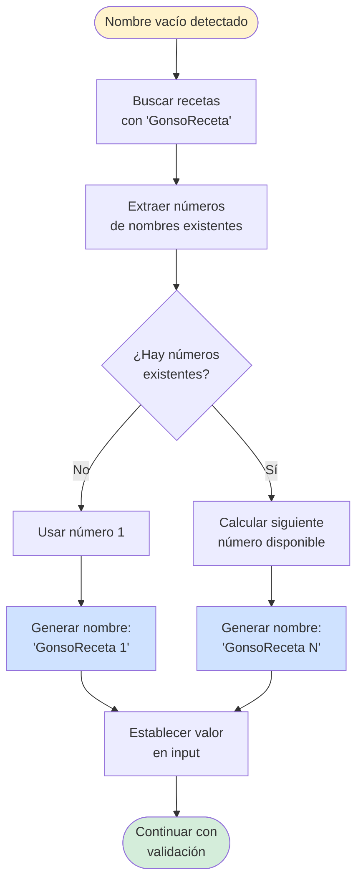
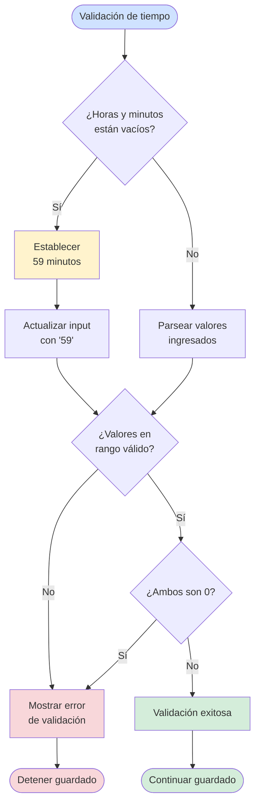
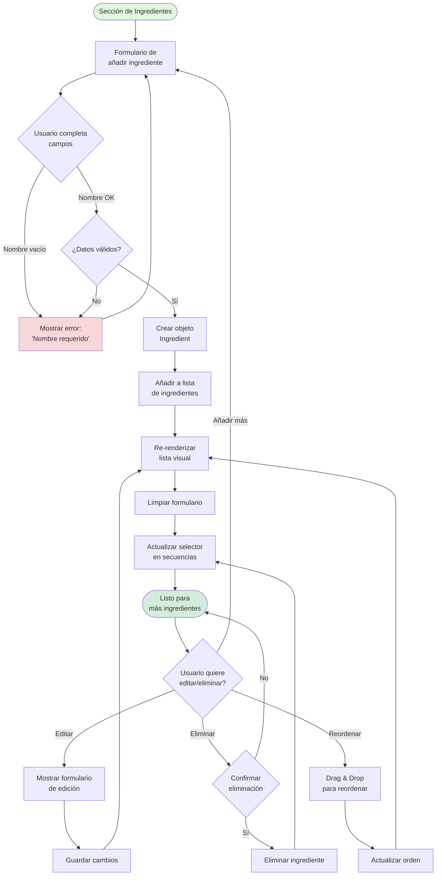
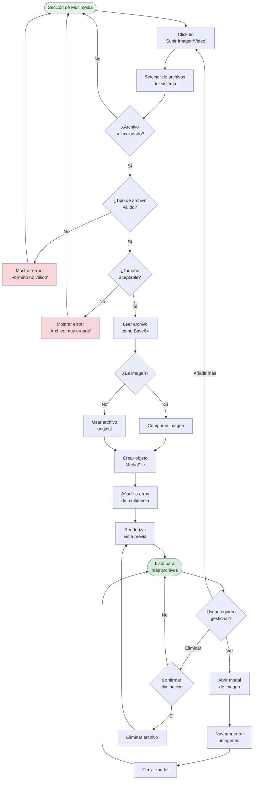

# 📊 Diagrama de Flujo - Creación de Receta

## mehaquedadobien 🍳

---

## 🔄 Flujo Principal de Creación de Receta

```mermaid
flowchart TD
    Start([Usuario en Lista de Recetas]) --> ClickNew[Click en 'Nueva Receta']
    ClickNew --> ShowForm[Mostrar Formulario Vacío]
    
    ShowForm --> FillForm{Usuario completa<br/>el formulario}
    
    FillForm --> |Nombre vacío| AutoName[Auto-generar<br/>'GonsoReceta N']
    FillForm --> |Nombre escrito| UseName[Usar nombre<br/>del usuario]
    
    AutoName --> CheckTime
    UseName --> CheckTime
    
    CheckTime{¿Tiempo<br/>especificado?}
    CheckTime --> |No| AutoTime[Auto-establecer<br/>59 minutos]
    CheckTime --> |Sí| UseTime[Usar tiempo<br/>del usuario]
    
    AutoTime --> ValidateTime
    UseTime --> ValidateTime
    
    ValidateTime{¿Tiempo<br/>válido?}
    ValidateTime --> |No| ShowTimeError[Mostrar error<br/>de validación]
    ShowTimeError --> FillForm
    ValidateTime --> |Sí| CheckCategory
    
    CheckCategory{¿Categoría<br/>seleccionada?}
    CheckCategory --> |No| NoCategory[Sin categoría]
    CheckCategory --> |Sí| WithCategory[Asignar categoría]
    
    NoCategory --> CheckAppliances
    WithCategory --> CheckAppliances
    
    CheckAppliances{¿Aparatos<br/>seleccionados?}
    CheckAppliances --> |No| NoAppliances[Sin aparatos]
    CheckAppliances --> |Sí| WithAppliances[Guardar aparatos]
    
    NoAppliances --> CheckIngredients
    WithAppliances --> CheckIngredients
    
    CheckIngredients{¿Ingredientes<br/>añadidos?}
    CheckIngredients --> |No| NoIngredients[Lista vacía]
    CheckIngredients --> |Sí| WithIngredients[Guardar ingredientes]
    
    NoIngredients --> CheckSequences
    WithIngredients --> CheckSequences
    
    CheckSequences{¿Secuencias<br/>añadidas?}
    CheckSequences --> |No| NoSequences[Lista vacía]
    CheckSequences --> |Sí| WithSequences[Guardar secuencias]
    
    NoSequences --> CheckMedia
    WithSequences --> CheckMedia
    
    CheckMedia{¿Imágenes/Videos<br/>subidos?}
    CheckMedia --> |No| NoMedia[Sin multimedia]
    CheckMedia --> |Sí| WithMedia[Guardar multimedia]
    
    NoMedia --> CheckExtra
    WithMedia --> CheckExtra
    
    CheckExtra{¿Autor/Historia<br/>completados?}
    CheckExtra --> |No| NoExtra[Sin info adicional]
    CheckExtra --> |Sí| WithExtra[Guardar info adicional]
    
    NoExtra --> ClickSave
    WithExtra --> ClickSave
    
    ClickSave[Usuario click 'Guardar'] --> CreateRecipe[Crear objeto Recipe]
    
    CreateRecipe --> SaveDB{Guardar en<br/>IndexedDB}
    SaveDB --> |Error| ShowError[Mostrar error]
    ShowError --> FillForm
    
    SaveDB --> |Éxito| ShowSuccess[Mostrar mensaje<br/>de éxito]
    ShowSuccess --> ReloadList[Recargar lista<br/>de recetas]
    ReloadList --> CloseForm[Cerrar formulario]
    CloseForm --> End([Volver a Lista<br/>con nueva receta])
    
    style Start fill:#e1f5e1
    style End fill:#e1f5e1
    style AutoName fill:#fff3cd
    style AutoTime fill:#fff3cd
    style ShowSuccess fill:#d4edda
    style ShowError fill:#f8d7da
    style ShowTimeError fill:#f8d7da
```



---

## 🎯 Flujo de Auto-Generación de Nombre



---

## ⏱️ Flujo de Auto-Establecimiento de Tiempo



---

## 🔧 Flujo de Gestión de Ingredientes



---

## 📸 Flujo de Gestión de Multimedia



---

## 💾 Flujo de Guardado en Base de Datos

```mermaid
flowchart TD
    Start([Objeto Recipe creado]) --> CheckDB{¿IndexedDB<br/>disponible?}
    
    CheckDB --> |Sí| UseIndexedDB[Usar IndexedDB]
    CheckDB --> |No| UseLocalStorage[Usar localStorage<br/>fallback]
    
    UseIndexedDB --> OpenTransaction[Abrir transacción<br/>'readwrite']
    OpenTransaction --> PutRecipe[Ejecutar put()<br/>en object store]
    
    PutRecipe --> TransactionResult{¿Transacción<br/>exitosa?}
    TransactionResult --> |Error| CheckQuota{¿Error de<br/>cuota?}
    TransactionResult --> |Éxito| LogSuccess[Log: Receta guardada]
    
    CheckQuota --> |Sí| ShowQuotaError[Mostrar error:<br/>'Espacio insuficiente']
    CheckQuota --> |No| ShowGenericError[Mostrar error<br/>genérico]
    
    UseLocalStorage --> GetExisting[Obtener recetas<br/>existentes]
    GetExisting --> AddOrUpdate{¿Receta<br/>existe?}
    
    AddOrUpdate --> |Sí| UpdateArray[Actualizar en array]
    AddOrUpdate --> |No| PushArray[Añadir a array]
    
    UpdateArray --> SaveLS[Guardar en<br/>localStorage]
    PushArray --> SaveLS
    
    SaveLS --> LSResult{¿Guardado<br/>exitoso?}
    LSResult --> |Error| CheckQuotaLS{¿Error de<br/>cuota?}
    LSResult --> |Éxito| LogSuccess
    
    CheckQuotaLS --> |Sí| ShowQuotaError
    CheckQuotaLS --> |No| ShowGenericError
    
    LogSuccess --> ReturnID[Retornar ID<br/>de receta]
    ReturnID --> End([Guardado completado])
    
    ShowQuotaError --> End2([Guardado fallido])
    ShowGenericError --> End2
    
    style Start fill:#cfe2ff
    style End fill:#d4edda
    style End2 fill:#f8d7da
    style LogSuccess fill:#d4edda
    style ShowQuotaError fill:#f8d7da
    style ShowGenericError fill:#f8d7da
```

---

## 📊 Resumen de Decisiones Clave

### ✅ Campos Opcionales con Auto-Generación

| Campo | Comportamiento |
|-------|---------------|
| **Nombre** | Si vacío → "GonsoReceta N" |
| **Tiempo** | Si vacío → "59min" |
| **Categoría** | Opcional (puede ser null) |
| **Aparatos** | Opcional (array vacío) |
| **Ingredientes** | Opcional (array vacío) |
| **Secuencias** | Opcional (array vacío) |
| **Multimedia** | Opcional (arrays vacíos) |
| **Autor/Historia** | Opcional (strings vacíos) |

### 🔄 Validaciones Aplicadas

1. **Nombre:** 
   - Auto-generado si vacío
   - Mínimo 3 caracteres si se escribe
   - Máximo 100 caracteres
   - Solo caracteres alfanuméricos y puntuación común

2. **Tiempo:**
   - Auto-establecido a 59min si vacío
   - Horas: 0-24
   - Minutos: 0-59
   - Al menos uno debe ser > 0

3. **Ingredientes:**
   - Nombre obligatorio
   - Cantidad y unidad opcionales
   - Formato inteligente de visualización

4. **Multimedia:**
   - Validación de tipo de archivo
   - Validación de tamaño
   - Compresión automática de imágenes

---

**Fecha:** 30 de octubre de 2025  
**Versión:** 2.1  
**Proyecto:** mehaquedadobien 🍳
