# Mapa de Estilos CSS - mehaquedadobien 🍳

**Sistema de Diseño Inspirado en Airbnb**

---

## 🎨 Arquitectura del Sistema de Diseño

```mermaid
graph TD
    Root[":root CSS Variables"] --> Colors[Colores]
    Root --> Spacing[Espaciado]
    Root --> Radius[Border Radius]
    Root --> Shadows[Sombras]
    Root --> Typography[Tipografía]
    
    Colors --> Primary[Primarios]
    Colors --> Neutral[Neutrales]
    Colors --> Category[Categorías]
    Colors --> Functional[Funcionales]
    
    Primary --> P1["--color-primary: #FF385C"]
    Primary --> P2["--color-primary-dark: #E31C5F"]
    Primary --> P3["--color-primary-light: #FF5A5F"]
    
    Neutral --> N1["--color-text: #222222"]
    Neutral --> N2["--color-text-secondary: #717171"]
    Neutral --> N3["--color-background: #FFFFFF"]
    Neutral --> N4["--color-border: #DDDDDD"]
    
    Category --> C1["16 Categorías de Recetas"]
    Category --> C2["3 Categorías Especiales"]
    
    Functional --> F1["--color-success: #008A05"]
    Functional --> F2["--color-danger: #C13515"]
    Functional --> F3["--color-warning: #FFC043"]
    
    Spacing --> S1["Base: 8px Sistema"]
    Spacing --> S2["xs: 4px → xxl: 48px"]
    
    Radius --> R1["sm: 8px → xl: 24px"]
    
    Shadows --> SH1["sm, md, lg, hover"]
    
    Typography --> T1["Font: System Stack"]
    Typography --> T2["Weights: 400-700"]
    
    classDef primary fill:#FF385C,stroke:#E31C5F,stroke-width:2px,color:#fff
    classDef neutral fill:#F7F7F7,stroke:#DDDDDD,stroke-width:2px,color:#222
    classDef category fill:#667eea,stroke:#5a67d8,stroke-width:2px,color:#fff
    classDef functional fill:#48bb78,stroke:#38a169,stroke-width:2px,color:#fff
    
    class Primary,P1,P2,P3 primary
    class Neutral,N1,N2,N3,N4 neutral
    class Category,C1,C2 category
    class Functional,F1,F2,F3 functional
```

---

## 🎨 Sistema de Colores

### Paleta Principal (Airbnb)

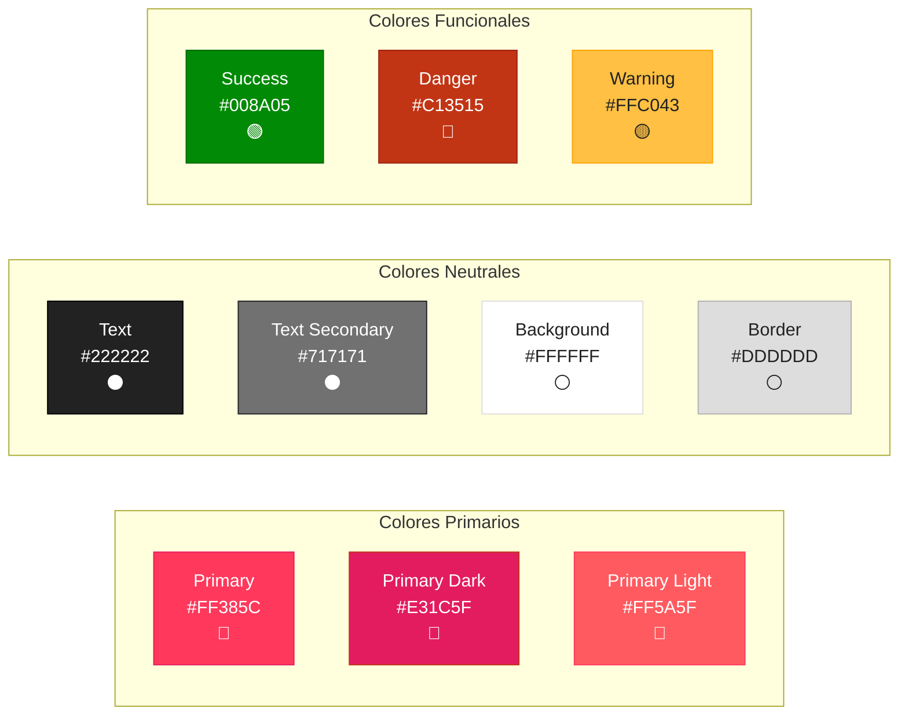

---

## 📏 Sistema de Espaciado (Base 8px)

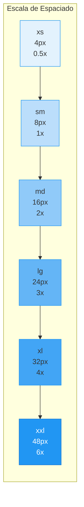

**Uso:**
- `xs (4px)`: Separación mínima entre elementos relacionados
- `sm (8px)`: Separación estándar entre elementos
- `md (16px)`: Separación entre secciones pequeñas
- `lg (24px)`: Separación entre secciones medianas
- `xl (32px)`: Separación entre secciones grandes
- `xxl (48px)`: Separación entre bloques principales

---

## 🔲 Sistema de Border Radius

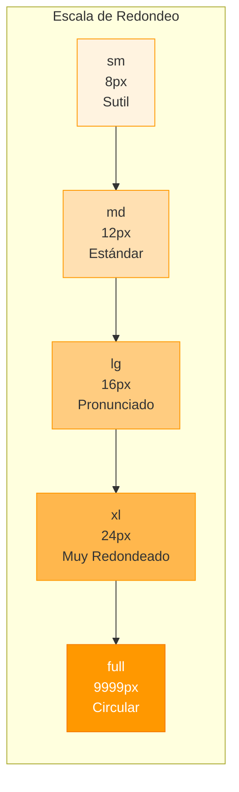

**Uso:**
- `sm (8px)`: Inputs, badges pequeños
- `md (12px)`: Botones, tarjetas (estándar Airbnb)
- `lg (16px)`: Modales, contenedores grandes
- `xl (24px)`: Elementos destacados
- `full (9999px)`: Botones circulares, avatares

---

## 🎭 Sistema de Sombras

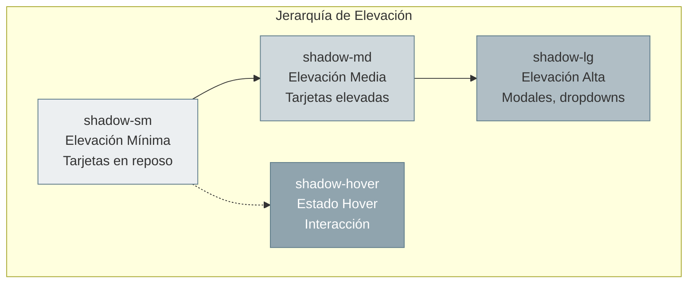

**Valores:**
```css
--shadow-sm: 0 1px 2px rgba(0,0,0,0.08), 0 4px 12px rgba(0,0,0,0.05);
--shadow-md: 0 2px 4px rgba(0,0,0,0.08), 0 8px 16px rgba(0,0,0,0.08);
--shadow-lg: 0 6px 16px rgba(0,0,0,0.12);
--shadow-hover: 0 2px 8px rgba(0,0,0,0.12);
```

---

## 📝 Sistema de Tipografía

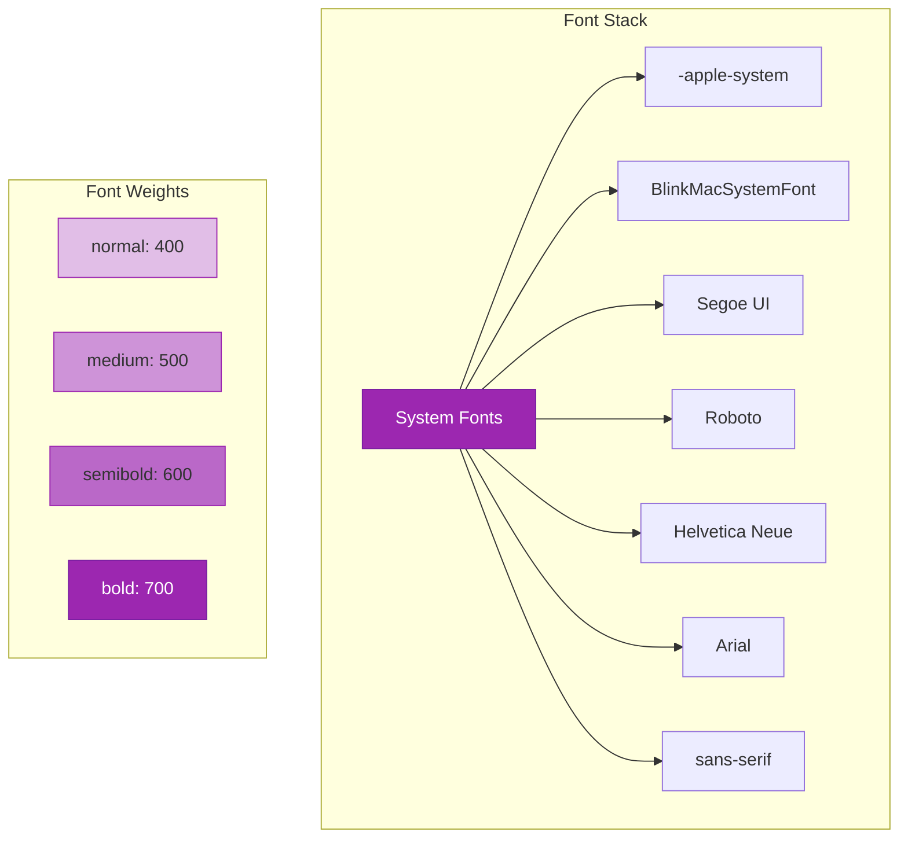

---

## 🎨 Colores de Categorías (19 categorías)

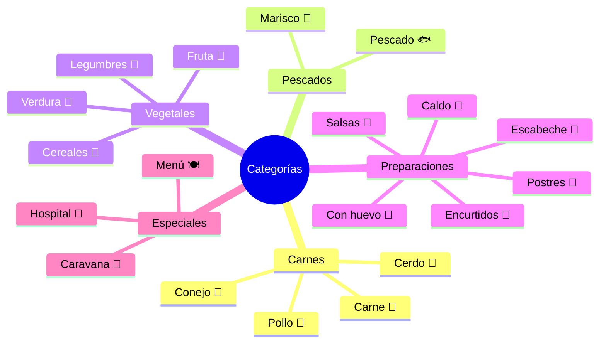

### Tabla de Colores de Categorías

| Categoría | Color | Hex | Emoji |
|-----------|-------|-----|-------|
| Caldo | Naranja | `#FF8C42` | 🍲 |
| Carne | Rojo | `#D93B30` | 🥩 |
| Cereales | Dorado | `#C4A053` | 🌾 |
| Cerdo | Rosa | `#FFB6C1` | 🐷 |
| Con huevo | Amarillo | `#FFD700` | 🥚 |
| Conejo | Rosa Claro | `#D4A5A5` | 🐰 |
| Encurtidos | Verde Lima | `#7CB342` | 🥒 |
| Escabeche | Verde | `#32CD32` | 🥒 |
| Fruta | Naranja | `#FF8C00` | 🍎 |
| Legumbres | Marrón | `#8D6E63` | 🫘 |
| Marisco | Rosa Fuerte | `#FF6B9D` | 🦐 |
| Pescado | Azul | `#0073CF` | 🐟 |
| Pollo | Naranja | `#FFA500` | 🐔 |
| Postres | Rosa | `#FFB6C1` | 🍰 |
| Salsas | Rojo | `#E53935` | 🍅 |
| Verdura | Verde | `#008A05` | 🥬 |
| **Caravana** | Gris | `#6B7280` | 🚐 |
| **Hospital** | Verde | `#10B981` | 🏥 |
| **Menú** | Marrón | `#8B4513` | 🍽️ |

---

## 🌓 Tema Oscuro

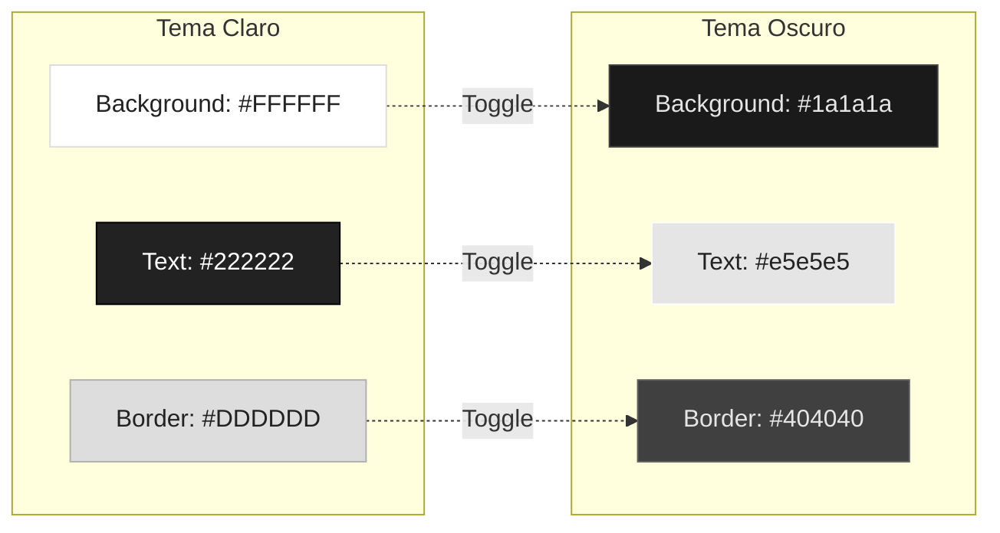

**Clase:** `body.dark-theme`

**Variables sobrescritas:**
```css
body.dark-theme {
    --color-text: #e5e5e5;
    --color-text-secondary: #a0a0a0;
    --color-background: #1a1a1a;
    --color-background-secondary: #2a2a2a;
    --color-border: #404040;
    --color-border-light: #333333;
}
```

---

## 🏗️ Estructura de Archivos CSS

```mermaid
graph TD
    A[styles.css] --> B[Variables CSS]
    A --> C[Reset & Base]
    A --> D[Layout]
    A --> E[Componentes]
    A --> F[Utilidades]
    A --> G[Responsive]
    A --> H[Tema Oscuro]
    
    B --> B1[":root"]
    
    C --> C1["*, body, .container"]
    
    D --> D1["Header"]
    D --> D2["Main"]
    D --> D3["Footer"]
    
    E --> E1["Botones"]
    E --> E2["Tarjetas"]
    E --> E3["Formularios"]
    E --> E4["Modales"]
    E --> E5["Badges"]
    
    F --> F1["Espaciado"]
    F --> F2["Colores"]
    F --> F3["Tipografía"]
    
    G --> G1["@media (max-width: 767px)"]
    G --> G2["@media (768px - 1024px)"]
    G --> G3["@media (min-width: 1025px)"]
    
    H --> H1["body.dark-theme"]
    
    style A fill:#667eea,stroke:#5a67d8,color:#fff
    style B fill:#48bb78,stroke:#38a169,color:#fff
    style E fill:#ed8936,stroke:#dd6b20,color:#fff
    style H fill:#4299e1,stroke:#3182ce,color:#fff
```

---

## 📦 Archivos CSS del Proyecto

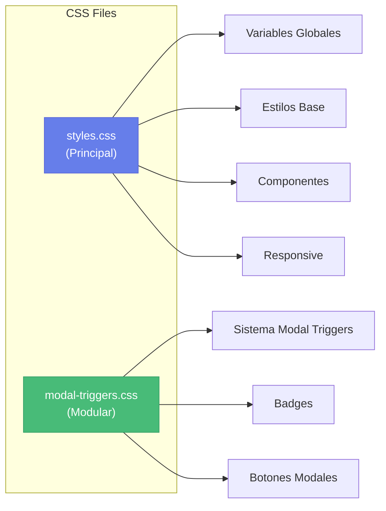

**Orden de carga en HTML:**
```html
<link rel="stylesheet" href="styles.css">        <!-- Línea 38 -->
<link rel="stylesheet" href="modal-triggers.css"> <!-- Línea 39 -->
```

---

## 🎯 Convenciones de Nomenclatura

### BEM (Block Element Modifier)

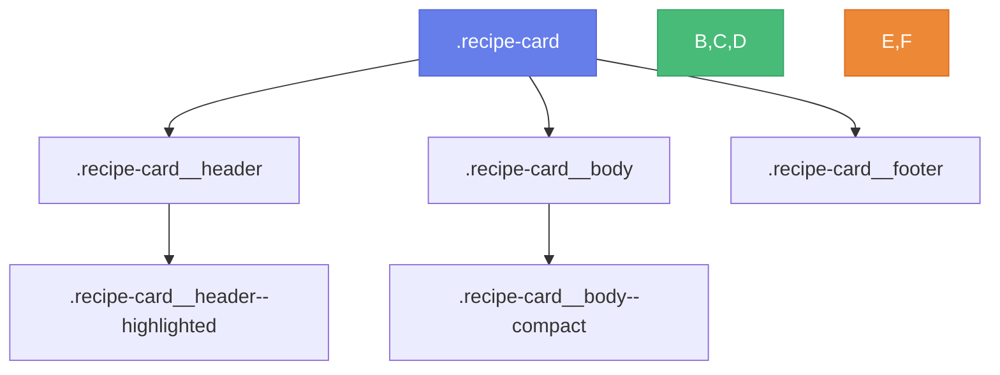

**Patrón:**
- **Block:** `.recipe-card`
- **Element:** `.recipe-card__header`
- **Modifier:** `.recipe-card__header--highlighted`

---

## 🔧 Clases Utilitarias

### Espaciado
```css
.mt-sm { margin-top: var(--spacing-sm); }
.mb-md { margin-bottom: var(--spacing-md); }
.p-lg { padding: var(--spacing-lg); }
```

### Display
```css
.hidden { display: none; }
.flex { display: flex; }
.grid { display: grid; }
```

### Colores
```css
.text-primary { color: var(--color-primary); }
.bg-success { background: var(--color-success); }
.border-danger { border-color: var(--color-danger); }
```

---

## 📱 Breakpoints Responsive

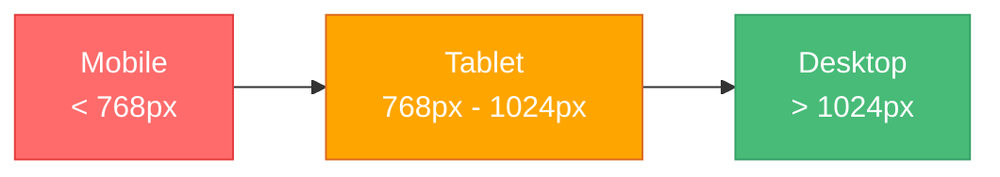

**Media Queries:**
```css
/* Mobile First */
@media (max-width: 767px) { /* Mobile */ }
@media (min-width: 768px) and (max-width: 1024px) { /* Tablet */ }
@media (min-width: 1025px) { /* Desktop */ }
```

---

## 🎨 Paleta de Colores Personalizada (Categorías Custom)

```javascript
const CATEGORY_COLORS = [
    '#FF6B6B', '#4ECDC4', '#45B7D1', '#FFA07A',
    '#98D8C8', '#F7DC6F', '#BB8FCE', '#85C1E2',
    '#F8B739', '#52B788', '#E76F51', '#2A9D8F'
];
```

**Visualización:**

```mermaid
graph LR
    subgraph "Paleta Custom (12 colores)"
        C1["#FF6B6B"]
        C2["#4ECDC4"]
        C3["#45B7D1"]
        C4["#FFA07A"]
        C5["#98D8C8"]
        C6["#F7DC6F"]
        C7["#BB8FCE"]
        C8["#85C1E2"]
        C9["#F8B739"]
        C10["#52B788"]
        C11["#E76F51"]
        C12["#2A9D8F"]
    end
    
    style C1 fill:#FF6B6B,stroke:#E53E3E,color:#fff
    style C2 fill:#4ECDC4,stroke:#3BA99C,color:#fff
    style C3 fill:#45B7D1,stroke:#3498DB,color:#fff
    style C4 fill:#FFA07A,stroke:#FF7F50,color:#fff
    style C5 fill:#98D8C8,stroke:#76C7B7,color:#fff
    style C6 fill:#F7DC6F,stroke:#F4D03F,color:#222
    style C7 fill:#BB8FCE,stroke:#9B59B6,color:#fff
    style C8 fill:#85C1E2,stroke:#5DADE2,color:#fff
    style C9 fill:#F8B739,stroke:#F39C12,color:#fff
    style C10 fill:#52B788,stroke:#27AE60,color:#fff
    style C11 fill:#E76F51,stroke:#E74C3C,color:#fff
    style C12 fill:#2A9D8F,stroke:#16A085,color:#fff
```

---

## 📚 Guía de Uso Rápida

### Aplicar Color Primario
```css
.elemento {
    color: var(--color-primary);
    background: var(--color-primary);
    border-color: var(--color-primary);
}
```

### Aplicar Espaciado
```css
.elemento {
    padding: var(--spacing-md);
    margin-bottom: var(--spacing-lg);
    gap: var(--spacing-sm);
}
```

### Aplicar Border Radius
```css
.elemento {
    border-radius: var(--radius-md);
}
```

### Aplicar Sombra
```css
.elemento {
    box-shadow: var(--shadow-sm);
}

.elemento:hover {
    box-shadow: var(--shadow-hover);
}
```

---

## 🎯 Mejores Prácticas

### ✅ Hacer
- Usar variables CSS en lugar de valores hardcoded
- Seguir la convención BEM para nombres de clases
- Usar el sistema de espaciado (múltiplos de 8px)
- Aplicar sombras según jerarquía
- Mantener consistencia con el tema Airbnb

### ❌ Evitar
- Valores mágicos (números sin contexto)
- Colores hardcoded
- Espaciado inconsistente
- Sombras excesivas
- Mezclar convenciones de nomenclatura

---

## 📊 Estadísticas del Sistema

- **Variables CSS:** 60+
- **Colores definidos:** 35+
- **Niveles de espaciado:** 6
- **Niveles de radius:** 5
- **Niveles de sombra:** 4
- **Font weights:** 4
- **Breakpoints:** 3
- **Archivos CSS:** 2

---

**Última actualización:** 7 de noviembre de 2025  
**Versión del sistema:** 2.0 (Airbnb-inspired)
